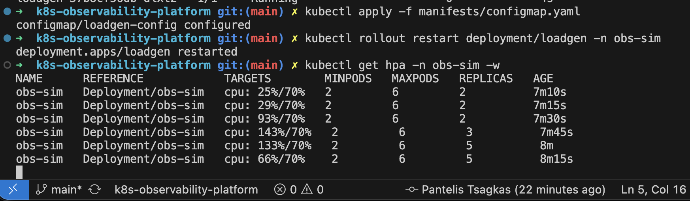
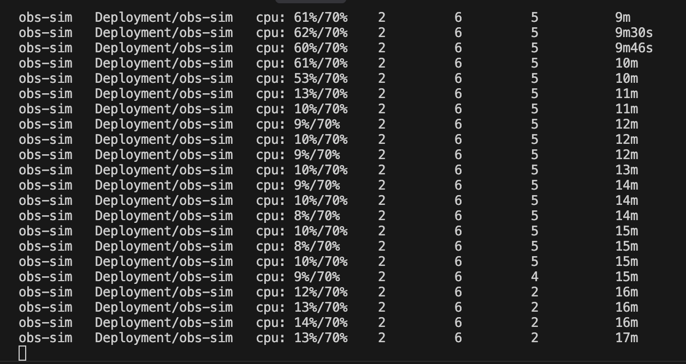
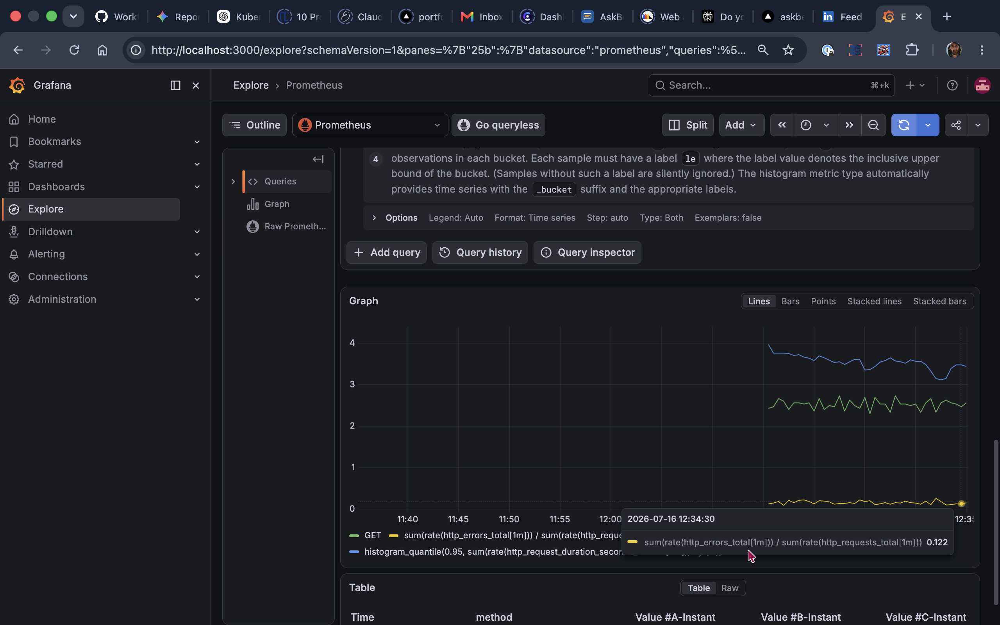
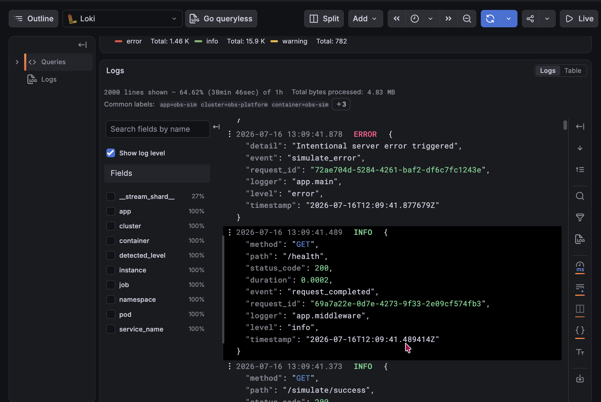
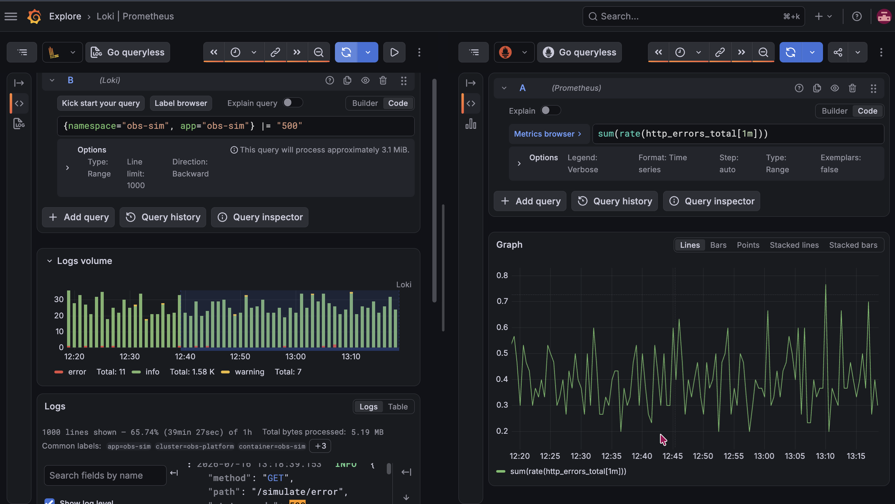

# k8s-observability-platform

**Status: ACTIVE** - Phase 2 done: ArgoCD watches this repo and reconciles
the cluster to match `main`. The obs-sim chart is deployed by committing to
git, not by running `helm`/`kubectl`. Phases 0-1 (manifests, Helm chart,
kube-prometheus-stack, Loki + Alloy) are done; Grafana shows app metrics and
logs correlated on one time axis. Phase 3 (EKS with Terraform) is next.

Runs [observability-simulator](https://github.com/PantelisTsagkas/observability-simulator)
(an instrumented FastAPI app) on Kubernetes: first locally on k3d with
hand-written manifests, then packaged with Helm, deployed via ArgoCD, and
finally on AWS EKS provisioned with Terraform.

This is a deployment/platform repo. The application lives in its own repo and
is consumed here as a container image from GHCR. The only application code
here is a small load generator (`apps/loadgen`) that gives the cluster
multi-service traffic worth observing.

## Phases

| Phase | Goal | Status |
|-------|------|--------|
| 0 | Raw manifests on k3d: Deployment, Service, ConfigMap, Ingress, HPA | Done |
| 1 | Helm chart + kube-prometheus-stack + Loki/Alloy | Done |
| 2 | GitOps with ArgoCD, commit-to-deployed | Done |
| 3 | EKS with Terraform, deploy the same charts, destroy same day | Not started |

## Architecture

Unchanged by Phases 1-2: the chart renders down to exactly these objects.
Only how they get applied changed - by hand in Phase 0, `helm install` in
Phase 1, and a git commit reconciled by ArgoCD in Phase 2.

```
localhost:8080
      |
k3d loadbalancer (host port 8080 -> cluster port 80)
      |
Traefik ingress controller (bundled with k3s)
      |
Service obs-sim (ClusterIP, selects app=obs-sim pods)
      |
Deployment obs-sim (2-6 replicas, managed by HPA)
      ^
Deployment loadgen (mixed success/error/slow traffic,
                    tuned via ConfigMap loadgen-config)
```

Both images are multi-arch (amd64 + arm64), built and pushed to GHCR by CI:
`ghcr.io/pantelistsagkas/observability-simulator` from the app repo, and
`ghcr.io/pantelistsagkas/obs-loadgen` from this repo.

## Running

Prerequisites: docker, kubectl, helm, k3d (all via `brew install`).

```bash
# The port mapping is load-bearing: it maps localhost:8080 to the
# cluster's ingress controller, which is how the app is reached.
k3d cluster create obs-platform --agents 2 --port "8080:80@loadbalancer"

helm install obs-sim ./charts/obs-sim -n obs-sim --create-namespace

# Wait for everything to come up
kubectl get pods -n obs-sim -w
```

This `helm install` is the Phase 1 path, shown here because it is the
clearest way to see the chart applied directly. From Phase 2 on, the app is
deployed by ArgoCD from git instead (see [GitOps with ArgoCD](#gitops-with-argocd-phase-2));
the manual `helm upgrade --set` below still works for a quick local
experiment, but the reconciled truth lives in `main`.

Verify:

```bash
curl -s localhost:8080/health          # {"status":"healthy"}
curl -s localhost:8080/metrics | head  # Prometheus metrics, counters climbing
kubectl get hpa -n obs-sim             # cpu utilization vs 70% target
kubectl logs deployment/loadgen -n obs-sim --tail 5   # traffic mix in action
```

To watch the HPA scale, raise the load:

```bash
helm upgrade obs-sim ./charts/obs-sim -n obs-sim \
  --set loadgen.config.RPS=300 --set loadgen.config.CONCURRENCY=50

kubectl get hpa -n obs-sim -w
```

No `kubectl rollout restart` needed any more. The loadgen pod template
carries a `checksum/config` annotation holding a hash of the rendered
ConfigMap, so a traffic-profile change alters the pod template and the
pods roll on their own. Under Phase 0 this was a manual step, and
forgetting it made config edits look broken.


*Phase 0: the HPA scales obs-sim from 2 to 5 replicas as load ramps, measuring CPU against the 70% target.*

Scale-down is deliberately slower (a ~5 minute stabilization window prevents
flapping): load drops at 11m, replicas step 5 -> 4 -> 2 around 15m.


*Phase 0: scale-down respects the ~5 minute stabilization window, stepping 5 -> 4 -> 2 rather than dropping all at once.*

Teardown: `k3d cluster delete obs-platform`.

## Layout

```
apps/loadgen/     # load generator (Python, uv, tested with pytest)
charts/obs-sim/   # Phase 1: the Helm chart deployments run from
manifests/        # Phase 0: hand-written YAML, superseded by the chart,
                  # kept as the artifact it was derived from
monitoring/       # Phase 1: values files for the observability stack
                  # (Loki, Alloy, the Grafana Loki datasource)
gitops/argocd/    # Phase 2: ArgoCD bootstrap values + the obs-sim Application
docs/             # screenshots, decisions, EKS writeup (Phase 3)
```

## The chart

`charts/obs-sim` is hand-written rather than `helm create` scaffolding:
each template is a Phase 0 manifest with the environment-specific values
lifted into `values.yaml`, comments intact.

What `values.yaml` exposes is deliberate. The filter was "does this differ
between k3d today and EKS in Phase 3?" - image tags, replicas, resources,
the loadgen traffic profile, HPA bounds, and `ingress.className` (which is
`traefik` locally and becomes `alb` on EKS: one value, the whole point of
Phase 3). Ports, probe paths and `securityContext` stay hardcoded, because
they are properties of the app rather than deployment choices.

`manifests/` is no longer applied. It stays as a reference for what the
chart renders down to.

## Observability stack (Phase 1)

Installed with Helm into a separate `monitoring` namespace, values files
checked in under `monitoring/` so the stack is reproducible from the repo:

- **kube-prometheus-stack**: Prometheus Operator, Prometheus, Alertmanager,
  Grafana, node-exporter, kube-state-metrics.
- **Loki** in single-binary, filesystem-backed mode
  (`monitoring/loki-values.yaml`). Deliberately small: production Loki uses
  object storage and a scaled read/write/backend split.
- **Grafana Alloy** as a DaemonSet log collector
  (`monitoring/alloy-values.yaml`). Alloy is Grafana's OpenTelemetry
  Collector distribution and the replacement for Promtail, which reached
  end-of-life in March 2026.

Metrics reach Prometheus through a `ServiceMonitor` shipped in the chart
(`charts/obs-sim/templates/servicemonitor.yaml`): a declarative CRD the
Prometheus Operator watches and compiles into scrape config, so pods that
come and go, or scale under the HPA, are picked up with no config edits.
Logs reach Loki through Alloy, which discovers each node's pods and promotes
a small, low-cardinality label set (`namespace`, `pod`, `container`, `app`)
before shipping the lines. Loki is wired into Grafana as a datasource by a
sidecar-provisioned ConfigMap (`monitoring/loki-datasource.yaml`).


*The three golden signals, each built from `rate()` of the app's counters: request rate, error ratio, and p95 latency. The error ratio reads ~0.12 rather than the loadgen's configured 0.20, because `/health` probe traffic pads the denominator with guaranteed 200s (see Lessons).*


*Structured logs in Loki, queryable by the low-cardinality labels Alloy promotes (`app`, `namespace`, `pod`, `container`, `cluster`). An intentional `ERROR` from `/simulate/error` sits next to a routine `/health` `INFO` line: HTTP status and log level are different axes.*

The payoff is correlation. An error-rate spike in Prometheus
(`sum(rate(http_errors_total[1m]))`) lines up, on a shared time axis, with
the actual `500` log lines from `/simulate/error` in Loki. Metrics say what
and when; logs say why.


*The whole point of the stack: an `http_errors_total` rate spike (right) aligns with the `500` log lines from `/simulate/error` (left), same time window, one pane.*

CI lints and renders the chart on every PR that touches it, including the
`hpa.enabled=false` and `ingress.enabled=false` paths that default values
never exercise. It also asserts the invariant the chart exists to protect:
with the HPA enabled, the obs-sim Deployment must not render a `replicas`
field, or `helm upgrade` would reset the count and fight the autoscaler.
That failure is silent in a cluster, so it is caught before merge instead.

## GitOps with ArgoCD (Phase 2)

ArgoCD runs in its own `argocd` namespace and continuously reconciles the
cluster to match git. The obs-sim chart is no longer installed with `helm`;
it is described by one Application manifest (`gitops/argocd/application.yaml`)
that points ArgoCD at `charts/obs-sim` on `main`, with `prune` and `selfHeal`
on. Deploying a change means merging to `main` - nothing is applied by hand.

Bootstrap is the one honest exception: ArgoCD cannot install itself with
ArgoCD, so the controller goes on with a single pinned `helm install`
(`gitops/argocd/README.md`), the same reproducibility discipline the Phase 1
stack now follows. After that, git is the only interface.

Handing the app over from the Phase 1 `helm` release meant
`helm uninstall obs-sim` first, so ArgoCD is the sole reconciler rather than
a second controller fighting Helm over the same objects. ArgoCD then recreated
every object - Deployment, Service, HPA, Ingress, ConfigMap, ServiceMonitor -
and reported `Synced`/`Healthy`.

The proof is a values change with nothing run against the cluster: bumping
`loadgen.config.RPS` from 2 to 3 and merging to `main`. ArgoCD picked up the
commit on its next git poll (~80s, no webhook on local k3d), updated the
ConfigMap, and because the loadgen pod template carries a `checksum/config`
hash, the pod rolled to the new profile on its own. A git commit reached a
running pod with no `helm` or `kubectl`.

## Lessons that cost debugging time (Phase 2)

- ArgoCD reads git, not your working tree. `targetRevision: main` means a
  change is "deployed" only once it is on `main`; a feature branch is
  invisible to it. This is the first thing that looks broken for no reason -
  the cluster simply reflects a ref you have not merged to yet.
- The Phase 1 chart omits `spec.replicas` under HPA to stop `helm upgrade`
  fighting the autoscaler. That same decision defends against a *different*
  differ for a *different* reason: ArgoCD has a built-in normalizer that
  ignores a Deployment's `replicas` when the manifest does not set it, so the
  app stays `Synced` with live at `replicas: 2` and git specifying none - no
  `ignoreDifferences` needed. One chart choice, two reconcilers, verified live
  with a hard refresh rather than assumed.
- Bringing an existing `helm` release under ArgoCD needs the release removed
  first. Two controllers reconciling the same objects is drift by design;
  `helm uninstall` (keeping the namespace) hands ownership over cleanly.
- ArgoCD's default git poll is ~3 minutes, so a merge lands with a lag and no
  visible cause. It is a poll, not a push: a webhook removes the delay, but on
  a local cluster the lag is expected, not a stuck sync.

## Lessons that cost debugging time (Phase 0)

- `runAsNonRoot: true` needs a *numeric* `USER` in the Dockerfile; the kubelet
  cannot verify a username, and fails with `CreateContainerConfigError`.
- A wrong `containerPort` broke both probes at once via the named port, and
  the liveness probe kept killing a perfectly healthy app. `kubectl describe`
  events tell the real story; `kubectl get pods` only says something is wrong.
- Env vars from a ConfigMap are read at container start. Editing the
  ConfigMap does nothing until `kubectl rollout restart`. (Phase 1 fixes
  this properly with a `checksum/config` annotation on the pod template.)
- Images built on GitHub's amd64 runners will not run on arm64 (Apple
  Silicon) nodes unless CI builds multi-arch with QEMU.
- Load generators have bottlenecks too: with 10% slow requests holding
  semaphore slots, concurrency 5 caps effective throughput near 30 rps no
  matter the configured RPS.

## Lessons that cost debugging time (Phase 1)

- Helm parse errors name where the Go template parser gave up, not where
  the mistake is. `function "ports" not defined` meant an unclosed `{{`
  on the *previous* line. `grep -n '{{' templates/*.yaml | grep -v '}}'`
  finds those in two seconds and points at the real line.
- Omitting `replicas:` from a Deployment does not mean "leave it alone".
  The API server defaults an absent `replicas` to 1. That is what you want
  when an HPA owns the count (it scales straight back to `minReplicas`),
  but it looks wrong: after install the two app pods have different ages.
- Templating `replicas` while an HPA owns it means every `helm upgrade`
  resets the count and fights the autoscaler. Render the field only when
  `hpa.enabled` is false.
- Kubernetes infers `imagePullPolicy` from the tag: `:latest` gets
  `Always`, any other tag gets `IfNotPresent`. Setting `IfNotPresent`
  explicitly on a `:latest` image means newly pushed builds are never
  pulled, and nothing anywhere reports an error.
- Never hardcode `namespace:` in a chart template. Helm sets it from `-n`.
  Hardcoding it means `helm install -n staging` records the release in one
  namespace and creates the objects in another, silently.
- `kubectl diff -f <rendered.yaml>` against the still-running Phase 0
  objects was the cheapest way to prove chart parity: four of six objects
  came back with no diff, and the two that differed were both real
  findings. Cheaper and more convincing than reading `helm template`
  output, because it compares against reality rather than intent.
- "app: obs-sim" means three different things, and confusing them silently
  breaks scraping. `Service.spec.selector` selects Pods; a `ServiceMonitor`
  selects Services by their *metadata* labels (not the pod selector, so the
  Service needs its own `app` metadata label); and Prometheus only adopts
  ServiceMonitors that carry the operator's `release:` label. Miss any link
  and the target never appears, with no error anywhere. The Prometheus
  Targets page is the first place to look.
- Prometheus scrapes each pod endpoint individually, not the Service VIP.
  That is what makes per-pod metrics correct and lets HPA scaling show up as
  new targets automatically.
- An error-rate ratio is only as honest as its denominator. Kubernetes
  `/health` probe traffic (a steady stream of guaranteed 200s) diluted the
  measured error fraction from the configured 0.2 down to ~0.12. Scoping the
  denominator with `{exported_endpoint!="/health"}` recovered the real
  figure. Production SLOs hide behind health-check and probe traffic the
  same way.
- The Loki Helm chart's `deploymentMode` enum is `SingleBinary`; the docs
  site said `Monolithic`. Helm silently ignored the invalid value, kept the
  scaled default, and installed nothing but a gateway. `helm show values
  <chart>` is the source of truth, not the docs site.
- Loki indexes labels, not log bodies. Keep labels few and low-cardinality
  (never `request_id` or similar): each unique combination is a separate
  stream. Narrow by label first, then grep the body with `|=`.
